# 👋 Hi, I'm Sushant Yadav

<p align="center">
  <picture>
    <source media="(prefers-color-scheme: dark)" srcset="./dark.svg">
    <source media="(prefers-color-scheme: light)" srcset="./light.svg">
    
  </picture>
</p>

### 💻 Java-Focused Software Developer | B.Tech CSE Student | DSA Enthusiast

<p align="center">
  
</p>

<p align="center">
  <a href="https://github.com/">
    
  </a>
  <a href="https://www.linkedin.com/">
    
  </a>
  <a href="mailto:your-email@example.com">
    
  </a>
</p>

---

## 👨‍💻 About Me

I'm a **B.Tech Computer Science Engineering student at Babu Banarasi Das University (BBDU)**, focused on becoming a professional **Software Developer**.

I primarily work with **Java** and have a strong interest in **Data Structures & Algorithms, problem solving, backend development, and software engineering**.

Alongside Java, I have working knowledge of **Python, SQL, HTML, and CSS**, and I use **Git & GitHub** for version control and project management.

- 🎓 B.Tech in Computer Science Engineering
- 🏫 Babu Banarasi Das University, Lucknow
- 💻 Primary Language: **Java**
- 🐍 Intermediate: **Python**
- 🧠 Data Structures & Algorithms
- 🗄️ SQL & Database Fundamentals
- 🌐 HTML & CSS
- 🔧 Git & GitHub
- 🛠️ VS Code
- 🚀 Currently focused on becoming a **Software Developer**
- 📚 Continuously learning, building and improving

---

## 🧑‍💻 Tech Stack

### 💻 Programming Languages

<p>
  
  
  
</p>

### 🧠 Core Computer Science

<p>
  
  
  
  
</p>

### 🌐 Web Technologies

<p>
  
  
</p>

### 🔧 Tools & Version Control

<p>
  
  
  
</p>

---

## 🚀 What I'm Currently Working On

```text
Java
 ├── Object-Oriented Programming
 ├── Data Structures & Algorithms
 ├── Problem Solving
 └── Software Development

Python
 ├── Intermediate Programming
 ├── Automation
 └── Problem Solving

Database
 └── SQL

Web
 ├── HTML
 └── CSS
